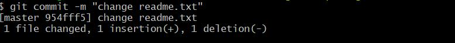

# 1.前沿
对于git内容学习整理。

## bash环境安装和配置
git版本管理工具远程访问github。
本地环境配置：
```
[root@VM-4-14-centos aeron-master]#  git config --global user.name "name"
[root@VM-4-14-centos aeron-master]#  git config --global user.email "email"
```
创建ssh-key:
```
ssh-keygen -t rsa -C 'kuangtuweb@gmail.com'
```
可以一路回车，然后在~/id_rsa.pub里面拷贝公钥到github页面:


# 2.基础内容
## 2.1 本地创建
### 2.1.1  git init 
生成了.git目录，对于文件、指针等进行存放。

## 2.2 添加文件、文件夹
### 2.2.1 git add filename
执行上面的命令，没有任何显示，这就对了，Unix的哲学是“没有消息就是好消息”，说明添加成功。
支持保存到了暂存区。


### 2.2.2 git commit -m "comment"

对于放到暂存区的变动进行提交。


1个文件变动了，2个insert。

如果commit之前需要修改注释，可以通过```git commit -amend``` 进行修改。

### 2.2.3 git status 查看状态

查看状态，对于之前的readme.txt文件修改其中一行的内容。
此时执行```git status```：


显示了“modified: readme.txt”，并且提示了没有增加到暂存区。


### 2.2.4 git diff

展示和之前的不同：


可以看到，在1-2行的时候，出现了差异。


### 2.2.5 再次提交 

修改readme文件之后，可以看到，git提示将要提交的是readme.txt文件，然后commit：




### 2.2.6 修改目录


## 2.3 版本查看

### 2.3.1 git log

查看一下每次提交的历史信息：


上面日志信息相对比较全面，可以通过参数"--pretty=oneline"显示简洁版本：


## 2.4 版本回退

在Git中，用HEAD表示当前版本上一个版本就是HEAD^，上上一个版本就是HEAD^^，当然往上100个版本写100个^比较容易数不过来，所以写成HEAD~100。

### 2.4.1 回退到上一个版本

```git reset --hard HEAD^```：

也看到已经回退到了954fff5这个版本。

### 2.4.2 回退到特定版本

```git reset --hard 提交编号```：


### 2.4.3 查看提交id

查看历史命令，得到之前提交的commit id：


## 2.5 工作区和暂存区

### 2.5.1 工作区

即：开发生成的目录。

### 2.5.2  版本库（Repository）

工作区有一个隐藏目录.git，这个不算工作区，而是Git的版本库。

版本库中存放了很多东西：其中最重要的就是称为stage（或者叫index）的暂存区，还有Git为我们自动创建的第一个分支master，以及指向master的一个指针叫HEAD。


上图来自[云峰就她了](https://xiaorui.cc/archives/category/%e6%8a%80%e6%9c%af%e5%88%86%e4%ba%ab)的分享，作者其他的分享也都非常精彩，墙裂推荐。


## 2.6 撤销修改

根据不同的情况，撤销修改操作有所不同：

（1）没有增加到暂存区，直接回到和版本库一样的状态；
命令git checkout -- readme.txt意思就是，把readme.txt文件在工作区的修改全部撤销，这里有两种情况：

一种是readme.txt自修改后还没有被放到暂存区，现在，撤销修改就回到和版本库一模一样的状态；

一种是readme.txt已经添加到暂存区后，又作了修改，现在，撤销修改就回到添加到暂存区后的状态。

总之，就是让这个文件回到最近一次git commit或git add时的状态。
（2）如果增到了暂存区，通过reset HEAD 回退到工作区。
（3）git status，暂存区是干净的，工作区有修改。


## 2.7 远程仓库操作

### 2.7.1 查看远程仓库信息

```bash
$ git remote -v
origin  git@github.com:kuangtu/gitskills.git (fetch)
origin  git@github.com:kuangtu/gitskills.git (push)
```

### 2.7.2 切换远程仓库URL

```bash
git remote set-url origin git@github.com:OWNER/REPOSITORY.git
```

## 分支管理
### 创建分支
`git branch name` 创建一个分支。

### 切换分支
`git checkout name` 切换一个分支。

### 创建并切换分支
`git checkout -b name` 创建并切换分支。

### 查看分支
`git branch` 查看所有分支信息。

### 删除分支
`git branch -d dev` 删除该分支。
 

## 合并

### 远程仓库和本地代码都已修改

远程仓库别人已经提交，较本地代码更”新”。然后本地代码也做了修改。

此时执行`git pull`，报错：


此时可以通过stach 命令先将本地的修改进行保存：

```bash
$ git stash
Saved working directory and index state WIP on main: e2edb2f aeron

```

然后`git pull`拉去远程仓库代码：


然后通过`git stash pop`，进行合并：

```bash
$ git stash pop
Auto-merging 消息总线/readme.md
CONFLICT (content): Merge conflict in 消息总线/readme.md

```

出现冲突，需要手动合并。


# 3. 使用规范

主要包含了git的基本使用原则，以及提交规范。


以上图片来自于【1】。


# 本地化
针对本地中文环境中使用问题进行汇总。
## git bash 中文显示为数字
默认中文会显示转移乱码，设置：
```git config --global core.quotepath false```
[A few of my favourite Git settings]( https://gist.github.com/Aupajo/4133515)


# 其他疑难杂症

访问github 22端口超时，可以配置ssh访问github站点的时候使用443端口：

```
# Add section below to it
Host github.com
  Hostname ssh.github.com
  Port 443
```

编辑~/.ssh/config文件。


git clone的时候碰到 issuer certificate，是本地没有配置https信任的服务器。
将git中的sslverify关掉：

```
git config --global http.sslverify false
```

# 参考

【1】 [云峰就她了](https://xiaorui.cc/) ，**墙裂推荐**


